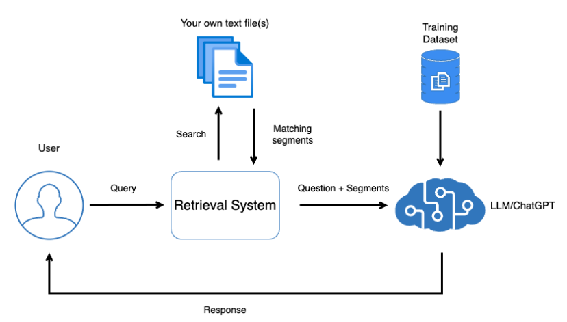
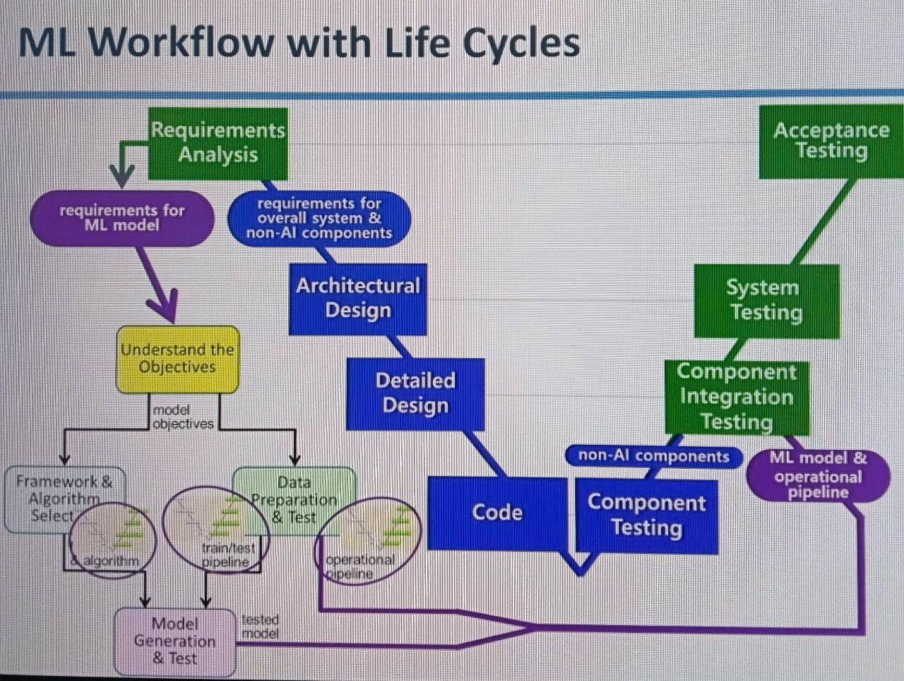

# Application diagram


# What to test


1. Static testing on provided knowledge, business requirements and codebase
    - To find out any likelihood of missmatch, miss config, existing bias in knowledge base or unreasonable requires at early stage 
2. Based on provided knowledge and business requirements
    - Component integration tests
        + Test against functionality accross many components
        + Test the response ability of the agent according to provided knowledge
    - System tests
        + Perform e2e test following business flow accross client side to server side
        + Can perform non-functional test 
3. Additional
    - Security check to see if the LLM agent expose or receive sensitive data
    - Engage with analytic team to improve test suite
    - Perform tests regularly to as a certain schedule to check existing of concept drift
    - May apply AB testing or back-to-back testing if business critical mission

## Automation
The regression test suite of Component integration tests and System tests
These tests will check the response ability of the agent base on the provided knowledge``

### Pre-condition
Must start the server by this following command:
```sh
yarn start
```

### Run all tests
Run the following command:
```sh
yarn test
```

### Open the GUI model
Run the following command:
```sh
yarn test:gui
```